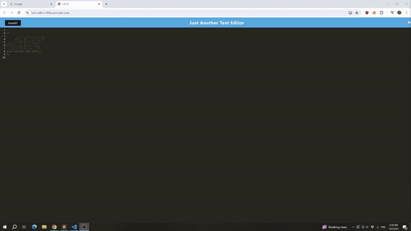

# Text Editor

## Description 

A text editor that can be run in the browser and that can be installed as a progressive web application.

**Features include**:

- Automatic text saving when the editor loses focus
- If the application is closed, previously saved text is saved locally and available
- Utilizes JavaScript syntax text highlighting
- Offline functionality in the browser when the page has been visited previously 
	- Assets are saved through cache and text content is saved both in IndexedDB and in local storage
- The web application can also be installed on a user's machine for continued offline usage

This exercise was provided by Northwestern University and edX through the Coding boot camp. Submitted as fulfillment of the Module 19 exercise during the December, 2023 - June, 2024 cohort.

## Table of Contents

- [Installation](#installation)
- [Usage](#usage)
- [Links](#links)
- [Credits](#credits)
- [License](#license)

## Installation

- From the deployed page, users can interact with a "Install" button in the upper, left-hand corner
- Users will be prompted to confirm that they would like to install the application
- After confirmation, users will find the application in their applications folder (similarly to other installed software) and can launch the application directly

## Usage

- Users can access the deployed page by utilizing the link provided in the section below
- Users can immediately begin using the text editor. Additional set up or user accounts are not required 
-  To save changes, users must click away from the editor. When the editor loses focus, changes to the text content will be saved and available for offline use
- As mentioned above, users can also install the application onto their local machine

## Links

- [Link to the deployed webpage](https://text-editor-00fq.onrender.com/)

- [Link to the GitHub repository](https://github.com/anthonyero/text-editor)

The relevant JavaScript, HTML, and CSS files are located within this repository. 

JavaScript files include comments detailing changes implemented within them. Further justifications can also be found within the repository's "Issues" tab.

Please refer to the commit history and branches within the repository for a tracked history of changes.

## Credits

Initial starter code was provided by Northwestern University and edX through the Coding boot camp. Starter files were uploaded in the commit: "Initial commit - starter files".

This application utilizes `Node.js` and the `express`, `webpack`, `workbox`, and additional npm packages for plugin functionalities.

## License

N/A

